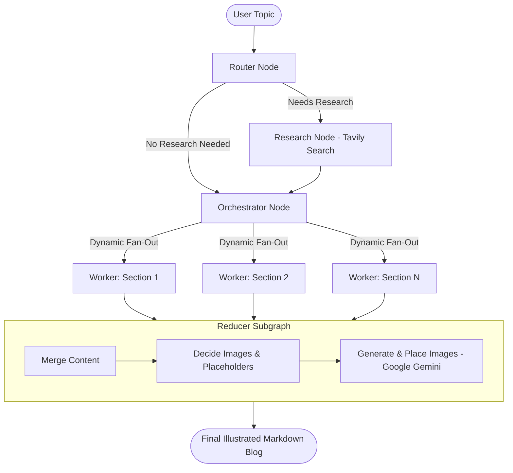

# ✍️ Autonomous Technical Blog Writing Agent

An enterprise-grade, multi-agent blog generation pipeline built with **LangGraph**, **LangChain**, **OpenAI GPT-4o / GPT-4.1-mini**, **Tavily Search**, and **Google Gemini**.

This project provides a full end-to-end system that autonomously routes topics, conducts live web research, builds structured outlines, writes sections concurrently using parallel workers, and plans/generates contextual technical diagrams before publishing a finished Markdown article.

---

## 🌟 Key Features

- 🧠 **Smart Dynamic Routing**: Classifies requests into `closed_book`, `hybrid`, or `open_book` modes and generates search queries only when research is necessary.
- 🔍 **Live Evidence Gathering (Tavily)**: Gathers authoritative sources, normalizes ISO publication dates, applies recency cutoffs, and grounds claims with real citations.
- 📐 **Hierarchical Orchestration**: The orchestrator produces a structured blueprint with task goals, specific bullet points, and word budgets for each section.
- ⚡ **Parallel Worker Fan-Out**: Uses LangGraph's `Send` API to dispatch section writing tasks to concurrent workers, drastically speeding up content generation.
- 🎨 **Automated Technical Illustration**: Technical editor subgraph identifies where diagrams are needed, prompts Google Gemini (`gemini-2.5-flash-image`) to synthesize diagrams, and seamlessly embeds them into the Markdown.
- 🖥️ **Interactive Streamlit UI**: Complete web interface with live streaming progress, evidence inspector, markdown preview, image gallery, and one-click ZIP packaging.
- 📚 **Step-by-Step Educational Notebooks**: 5 progressive Jupyter notebooks documenting the architectural evolution from a naive prompt to a full multi-agent system.

---

## 🏗️ Architecture & Workflow



---

## 📁 Repository Structure

```text
├── 1_bwa_basic.ipynb               # Step 1: Foundational single-node & basic blog generator
├── 2_bwa_improved_prompting.ipynb  # Step 2: Structured planning & advanced prompt design
├── 3_bwa_research.ipynb            # Step 3: Integrating live web research with Tavily
├── 4_bwa_research_fine_tuned.ipynb # Step 4: Fine-tuned evidence synthesis & citation grounding
├── 5_bwa_image.ipynb               # Step 5: Diagram planning & Gemini image generation
├── tavily_test.ipynb               # Standalone verification script for Tavily Search API
├── bwa_backend.py                  # Production LangGraph state graph and multi-agent workflow
├── bwa_frontend.py                 # Interactive Streamlit dashboard
├── requirements.txt                # Python package dependencies
├── .env.example                    # Sample environment variables configuration
├── .gitignore                      # Git ignore rules for virtual environments, keys & assets
└── README.md                       # Documentation
```

---

## 🚀 Quick Start

### 1. Clone the Repository

```bash
git clone https://github.com/ImLasya/Blog-writing-agent.git
cd Blog-writing-agent
```

### 2. Create and Activate a Virtual Environment

**Windows (PowerShell):**
```powershell
python -m venv .venv
.venv\Scripts\Activate.ps1
```

**macOS / Linux:**
```bash
python3 -m venv .venv
source .venv/bin/activate
```

### 3. Install Dependencies

```bash
pip install -r requirements.txt
```

### 4. Configure API Keys

Create a `.env` file in the root directory (you can copy `.env.example`):

```bash
cp .env.example .env
```

Add your API credentials:

```env
# OpenAI API Key (used for routing, planning, section writing, and image planning)
OPENAI_API_KEY=your_openai_api_key_here

# Tavily API Key (used for real-time web research)
TAVILY_API_KEY=your_tavily_api_key_here

# Google Gemini API Key (used for generating technical diagrams & illustrations)
GOOGLE_API_KEY=your_google_api_key_here
```

> **Where to obtain keys:**
> - OpenAI API: [platform.openai.com](https://platform.openai.com/)
> - Tavily Search API: [tavily.com](https://tavily.com/)
> - Google AI Studio (Gemini): [aistudio.google.com](https://aistudio.google.com/)

---

## 💻 Running the Application

### Launch the Streamlit Frontend

```bash
streamlit run bwa_frontend.py
```

Open your browser at `http://localhost:8501`. From the UI you can:
- Enter your blog topic (e.g. *"DeepSeek-R1 Architecture and Multi-Head Latent Attention"*).
- Select the blog style (`explainer`, `tutorial`, `news_roundup`, `comparison`, or `system_design`).
- Set audience expertise, tone, and recency constraints.
- Stream execution progress live across each node.
- Download the generated blog and diagrams bundled into a ready-to-publish `.zip` archive.

### Run Backend Directly via Python

```python
from bwa_backend import app

inputs = {
    "topic": "Explain Mixture of Agents (MoA) Architecture",
    "as_of": "2026-09-15",
    "recency_days": 30
}

result = app.invoke(inputs)
print(result["final"])
```

---

## 📖 Step-by-Step Learning Progression

If you want to understand how this system was constructed iteratively:

| Notebook | Focus Area |
| :--- | :--- |
| **`1_bwa_basic.ipynb`** | Building basic LangChain chains for drafting and simple text assembly. |
| **`2_bwa_improved_prompting.ipynb`** | Introducing structured outputs (`Pydantic`), task contracts, and persona prompts. |
| **`3_bwa_research.ipynb`** | Adding autonomous web search via Tavily to verify technical facts. |
| **`4_bwa_research_fine_tuned.ipynb`** | Enforcing strict citation rules, URL deduplication, and ISO date cutoffs. |
| **`5_bwa_image.ipynb`** | Introducing the image planning editor and multimodal synthesis with Gemini. |
| **`tavily_test.ipynb`** | Standalone sandbox for querying and testing Tavily Search output formats. |

---

## 🛠️ Technology Stack

- **Orchestration**: [LangGraph](https://github.com/langchain-ai/langgraph), [LangChain](https://github.com/langchain-ai/langchain)
- **Language Models**: OpenAI GPT-4o / GPT-4.1-mini
- **Search Tool**: [Tavily Search API](https://tavily.com/)
- **Image Generation**: Google GenAI (`gemini-2.5-flash-image`)
- **Data Validation**: Pydantic v2
- **Frontend Dashboard**: Streamlit
- **Environment**: Python 3.10+

---

## 📄 License

Distributed under the MIT License. See `LICENSE` for more information.
